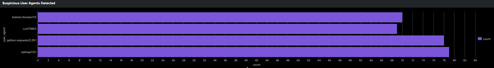
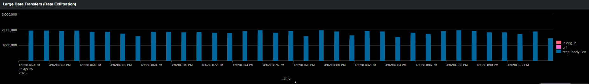

# Splunk HTTP Log Analysis Project (7 Security Dashboards)

This repository contains my complete end-to-end Splunk project for analyzing HTTP logs and detecting malicious activity using seven SOC-focused dashboards.  
I built these dashboards to identify threat patterns such as scanning, unusual methods, large data transfers, attack spikes, and sensitive file access attempts.

This project demonstrates my hands-on experience with:
- Log ingestion & parsing in Splunk
- Writing SPL queries for threat detection
- Creating SOC dashboards
- Investigating attacker behavior in HTTP logs
- Identifying anomalies & attack patterns

---

## 📌 Project Overview

This repository contains everything required to reproduce my Splunk project:

✔ Raw HTTP log dataset  
✔ All SPL queries  
✔ All 7 Splunk dashboards (exported XML)  
✔ Step-by-step documentation  
✔ Dashboard creation instructions  
✔ Troubleshooting guide  

This project is fully reproducible by anyone following the provided documentation.

---

## 📊 Dashboards Included (7 Total)

1. Suspicious User Agents Detected  
2. Error Code Analysis  
3. Top Attackers (Top Source IPs)  
4. Time-based Attack Timeline  
5. Sensitive File Access Attempts  
6. Unusual HTTP Methods  
7. Large Data Transfer Detection  

These dashboards together provide deep visibility into:
- Web scanning tools (sqlmap, curl, python scripts, botnet scanners)  
- Error spikes and misconfigurations  
- Attack origin sources  
- Time-based attack patterns  
- LFI attempts and sensitive file probing  
- Abuse of HTTP methods  
- Potential data exfiltration

---

## 📂 Repository Structure

splunk-http-log-analysis/
│
├── README.md
├── data/
│ └── http_logs.json
│
├── dashboards/
│ ├── sensitive_file_access_attempts.xml
│ ├── suspicious_user_agents.xml
│ ├── large_transfer_detection.xml
│ ├── unusual_http_methods.xml
│ ├── attack_timeline.xml
│ ├── error_code_analysis.xml
│ └── top_attackers.xml
│
├── images/
│ ├── dashboard1_sensitive_file_access.png
│ ├── dashboard2_suspicious_user_agents.png
│ ├── dashboard3_large_transfer_detection.png
│ ├── dashboard4_unusual_http_methods.png
│ ├── dashboard5_attack_timeline.png
│ ├── dashboard6_error_code_analysis.png
│ └── dashboard7_top_attackers.png
│
├── spl/
│ └── queries.md
│
└── docs/
├── splunk_ingestion_steps.md
├── dashboard_creation_steps.md
├── exporting_dashboards.md
└── troubleshooting.md

Each folder and file has a specific purpose to help others understand and reproduce the project easily.

---

## 📸 Dashboard Screenshots

Below are the dashboards in the order of detection importance:

### 1. Suspicious User Agents Detected  

### 2. Error Code Analysis  

### 3. Top Attackers (Top Source IPs)  

### 4. Time-based Attack Timeline  

### 5. Sensitive File Access Attempts  

### 6. Unusual HTTP Methods  

### 7. Large Data Transfer Detection  

---

## 🧪 Dataset Used

The dataset (`http_logs.json`) contains HTTP request records such as:
- HTTP method  
- URL/URI requested  
- User agent  
- Status codes  
- Response sizes  
- Source/Destination IPs  
- Event types  
- Timestamps  

This dataset helped me analyze:
- Recon activity  
- Errors  
- Admin page probes  
- Large transfers  
- Suspicious requests  
- Malicious tools like sqlmap, curl, python scripts, botnet scanners  

---

## 🛠 How to Reproduce This Project

All instructions are included in `/docs/`, including:

- **How to upload logs into Splunk**  
- **How to choose correct sourcetype (`_json`)**  
- **How to create index (httplogs)**  
- **How to write the SPL queries**  
- **How to build each dashboard panel**  
- **How to import/export dashboard XML files**  

Follow the docs and you will get the exact dashboards I created.

---

## 📁 Dashboard XML Files

All 7 dashboards built in Splunk are exported and stored in the `/dashboards/` folder.  
They can be imported using:

**Splunk → Dashboards → Import → Upload XML**

This instantly recreates my dashboards on any machine.

---

## 🎯 Skills Demonstrated

This project helped me develop:

### ✔ Splunk Log Ingestion  
### ✔ SPL Query Writing  
### ✔ Creating SOC-focused dashboards  
### ✔ Web attack pattern recognition  
### ✔ Threat detection using logs  
### ✔ Incident investigation approach  
### ✔ Identifying attacker TTPs  

---

## 🙌 Author

**Devraj Singh Kholiya**  
Aspiring SOC Analyst 
Delhi, India

---

## ⭐ If you like this project, feel free to star the repo!

